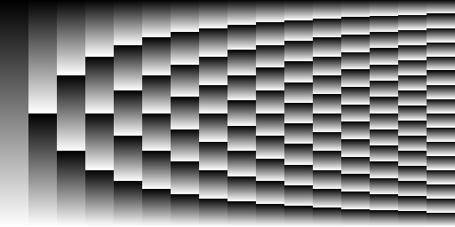

# Halftonism

Artistic halftone generation library


## Installation

```shell
pip install git+https://github.com/setanarut/halftonism
```

## Example

```python
from halftonism import Project

p = Project("example.ora", repeat=16, waveform="triangle")
p.save_GIF("example.gif", scale=0.25, miliseconds=70, colors=30, resample=3)
```

## Tutorial

### Preparing the ORA file


You can open the example.ora file in [example](./example/) folder with the [Krita](https://docs.krita.org/en/general_concepts/file_formats/file_ora.html). ([Openraster](https://www.openraster.org/) format). In the example you can see the color layers obtained using [fastLayerDecomposition](https://github.com/CraGL/fastLayerDecomposition) repository. After installing the halftonism package, the `folder2ora` command line tool is installed. Using this, you can convert the folder full of PNG layers obtained with [fastLayerDecomposition](https://github.com/CraGL/fastLayerDecomposition) into an ORA file. Saves it with the name `output.ora`.

```bash
$ folder2ora ~/Downloads/layers_folder

# saved -> ~/Downloads/layers_folder/output.ora
```

Alternatively you can decompose and save image as an ORA file with the [decompose](https://github.com/setanarut/decompose) package. [decompose](https://github.com/setanarut/decompose) package separates very quickly using pytorch but the colors are  inaccurate a little bit depending on the palette. 

```bash
$ decomp ~/Desktop/img.png
# Decomposer mask generation...
# Decomposer processing alpha layers...
# Decomposer Done!
# ORA saved: img.ora
# 7
# Palette saved: img_palette.png
```

Also you can paint it by hand without layer decompositing. Play around with layer orders and alpha levels for a more color balanced halftone outputs.  

#### ORA Layer Structure

Before processing the ORA file with Python, you have to follow the template below.

1. Each color layer should contain only a single color.

2. The bottom background layer (base color) must be solid color.

3. There should be a grayscale heightmap at the top layer for halftone patterns. Top layer can be a computer generated heightmap ([Hydraulic-Erosion](https://github.com/dandrino/terrain-erosion-3-ways#simulation), Mandelbrot fractals) or real [DEM heightmaps](https://tangrams.github.io/heightmapper/) or any suitable grayscale gradient.  


### ORA processing with halftonism package

Halftone animation is created with 256 pixels linear grayscale gradient [cycling](https://en.wikipedia.org/wiki/Color_cycling), also known as palette shifting or palette animation. The halftone pattern and color layer are mixed with the [*Hard Mix*]([https://](http://www.simplefilter.de/en/basics/mixmods.html)) blending mode (mix *halftone gradient pattern* and *color layer* by 50%. If the alpha value is greater than 128, set the color to 255, otherwise set the color to 0).  

#### `Project()` parameters

##### waveform

Waveform of gradient. `Project()` has parameters `waveform="sawtooth"`, `waveform="triangle"` and `waveform="sine"`. The effects are shown below, respectively.


##### repeat

This number determines how many times gradient will be divided. The formula` (256 / repeat) / frame_skipping` gives the number of animation frames. (frame_skipping is 1 by default, meaning it is disabled). For example, `repeat=8` will give 32 frames. (**256/8/1 = 32 frames**).

Let's save all sawtooth gradient repetitions from 1 to 16 as image. It will help to understand. Height increased from 256x1 to 256x32 and image rotated 90 degree for visibility.

```python
from PIL import Image
import numpy as np
from halftonism.utils import gradient_vstack, gradient


stack = gradient_vstack(gradient(1, "sawtooth"), 32)
for repeat in range(2, 17):
    stack = np.vstack((stack, gradient_vstack(gradient(repeat, "sawtooth"), 32)))
im = Image.fromarray(stack)
im.rotate(90, expand=True).save("gradient_repeats.png")

```



##### frame_skipping

You can skip frames to reduce GIF/APNG file size. This also reduces the frame jump effect in repeat numbers where the number 256 is not divisible, such as 3,7,10.

#### Antialiasing

For antialiasing, you can downscale image with [bicubic sampling](https://pillow.readthedocs.io/en/stable/handbook/concepts.html#PIL.Image.Resampling.BICUBIC). For example, you can start with 2000x2000 and downscale to 500x500 for final output (500 / 2000 = 0.25 scale). The `save_GIF()` `save_APNG()` and `save_frame()` methods have `scale` and [resample](https://pillow.readthedocs.io/en/stable/handbook/concepts.html#PIL.Image.Resampling.BICUBIC) arguments. 

Resampling example with `NEAREST` on the left and `BICUBIC` on the right. (scale 0.25)


```python
p.save_GIF("output.gif", scale=0.25, resample=Image.BICUBIC)
p.save_frame(0, "01_frame.png", scale=0.25., resample=3)
```
